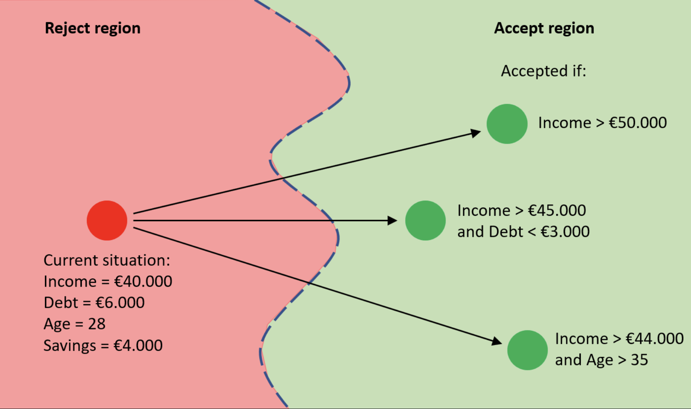

# Chapter 4: Contrastive and Counterfactual Explanations

**Author:** [Youssef Amr](https://www.linkedin.com/in/youssef-amr-2b019b274) (55-4624)
---

## 4.1 Introduction

Imagine you applied for a bank loan and were rejected. The bank's decision was made by a machine learning model — a black box trained on thousands of historical records. You want to understand: *why was I rejected?* But more importantly, you want to know: *what would I need to change to get approved?*

This is precisely the question that **contrastive** and **counterfactual explanations** are designed to answer. Rather than explaining the inner workings of a model in abstract terms, they explain decisions in terms of *contrast* — comparing what happened with what *could have* happened.

These explanations mirror how humans naturally reason. When we ask "why did you choose A over B?" we are asking for a *contrastive* explanation. When we imagine "if only I had done X differently, then Y would not have happened," we are engaging in *counterfactual* thinking. Machine learning interpretability has borrowed these concepts from cognitive science and philosophy to make AI decisions more understandable, actionable, and fair.

This chapter covers:

- The philosophical and cognitive foundations of contrastive and counterfactual reasoning
- How counterfactual explanations are formally defined and generated
- Key algorithms: DICE, Wachter et al., and others
- Evaluation criteria for good counterfactuals
- Legal and ethical implications (GDPR, algorithmic recourse)
- Connections to other chapters in this book
- Python library walkthroughs with code examples

---

## 4.2 Conceptual Foundations

### 4.2.1 What Is a Contrastive Explanation?

A **contrastive explanation** answers the question: *"Why P rather than Q?"* — where P is what actually happened and Q is an alternative that did not happen.

Lipton (1990) argued that most human explanations are inherently contrastive. When a child asks "why did the bridge collapse?", they are not asking for a complete causal history of the universe — they implicitly mean *"why did the bridge collapse rather than stay standing?"* The contrast class Q shapes which causes are considered relevant.

In machine learning, this translates to:

> *"Why was this applicant rejected (P) rather than approved (Q)?"*

The contrast class makes explanation tractable and relevant. Instead of explaining the entire model, we explain the *difference* between two outcomes.

### 4.2.2 What Is a Counterfactual Explanation?

A **counterfactual explanation** is a statement of the form:

> *"If X had been different, then Y would have been different."*

In the context of ML models, Wachter, Mittelstadt, and Russell (2017) formalized this as:

> *"You were denied a loan because your income was £30,000. If your income had been £45,000, you would have been approved."*

This is actionable: the person now knows what to change. It does not reveal the internal workings of the model — it simply describes the boundary between different decisions.

Counterfactuals differ from standard feature importance methods (like SHAP or LIME) in a crucial way:

| Method | Question Answered |
|---|---|
| SHAP / LIME | Which features mattered most for this prediction? |
| Counterfactual | What minimal change would flip this prediction? |

### 4.2.3 The Cognitive Science Angle

Ruth Byrne (2019) showed that counterfactual thinking is deeply embedded in human cognition. People naturally imagine "if only" scenarios after negative events, and they tend to:

1. **Mutate exceptional events** rather than normal ones (it's easier to imagine "if only I had taken a different route" than "if only gravity had been weaker")
2. **Prefer proximal causes** over distal ones
3. **Favor actions over inactions** as counterfactual antecedents

Good counterfactual explanation systems should align with these cognitive tendencies. An explanation that requires changing someone's age or birthplace is not only legally problematic — it's cognitively useless because it's not something the person can realistically imagine changing.

---

## 4.3 Formal Definition

Let:
- $f: \mathcal{X} \to \mathcal{Y}$ be a trained classifier
- $\mathbf{x} \in \mathcal{X}$ be the input instance (e.g., a loan applicant's features)
- $f(\mathbf{x}) = y$ be the model's prediction (e.g., "rejected")
- $y' \neq y$ be the desired outcome (e.g., "approved")

A **counterfactual example** $\mathbf{x}'$ is an input such that:

$$f(\mathbf{x}') = y' \quad \text{and} \quad \mathbf{x}' \approx \mathbf{x}$$

The second condition — $\mathbf{x}' \approx \mathbf{x}$ — captures the idea that $\mathbf{x}'$ should be as *close* as possible to the original $\mathbf{x}$. This is the minimal change requirement.

Wachter et al. (2017) formulated this as an optimization problem:

$$\mathbf{x}' = \arg\min_{\mathbf{x}'} \; \lambda \cdot (f(\mathbf{x}') - y')^2 + d(\mathbf{x}, \mathbf{x}')$$

Where:
- $\lambda$ controls the trade-off between prediction closeness and feature proximity
- $d(\mathbf{x}, \mathbf{x}')$ is a distance function (e.g., weighted $L_1$ or $L_2$ distance)

This elegant formulation requires no access to model internals — only the ability to query $f(\mathbf{x}')$. It is therefore **model-agnostic**.

---

## 4.4 Properties of Good Counterfactual Explanations

Not all counterfactuals are equally useful. Mothilal et al. (2020) identify several desiderata:

### 4.4.1 Proximity
The counterfactual should be as close as possible to the original instance. Changing 10 features is less useful than changing 1.

### 4.4.2 Sparsity
Prefer explanations that change **few features**. This is cognitively and practically easier to act on.

> ❌ Bad: Change your age, income, ZIP code, employment type, and marital status.  
> ✅ Good: Increase your income by €8,000.

### 4.4.3 Feasibility / Actionability
Some features cannot be changed — age, nationality, or past credit history. A counterfactual that says "if you were 10 years younger" is useless and potentially discriminatory. Good systems restrict counterfactuals to **actionable features**.

### 4.4.4 Diversity
A single counterfactual is often insufficient. A user should receive **multiple diverse alternatives**, each offering a different path to the desired outcome:

- Path A: Increase income by €10,000
- Path C: Increase income by €5,000 AND reduce debt by €3,000
- Path B: Increase income by €4,000 AND age by 7



*Figure 4.1: A rejected applicant (red) has multiple counterfactual paths across the ML model decision boundary into the accept region. Each arrow represents a different minimal change that achieves approval.*


### 4.4.5 Plausibility
The counterfactual $\mathbf{x}'$ should lie within the distribution of real data — not in an impossible or implausible region of feature space. A 22-year-old with 30 years of work experience is not a plausible counterfactual.

---

## 4.5 Key Algorithms

### 4.5.1 Wachter et al. (2017) — The Foundational Approach

The original formulation by Wachter, Mittelstadt, and Russell is gradient-based. Starting from $\mathbf{x}$, it performs gradient descent in feature space to find $\mathbf{x}'$ that satisfies the objective above.

**Strengths:**
- Simple and model-agnostic (via numerical gradients)
- Well-studied theoretically

**Limitations:**
- Generates a single counterfactual
- Does not enforce actionability or plausibility
- Can land in implausible data regions

### 4.5.2 DiCE — Diverse Counterfactual Explanations (Mothilal et al., 2020)

DiCE (Diverse Counterfactual Explanations) directly addresses the diversity limitation. It generates a **set** of counterfactuals by adding a determinantal point process (DPP) diversity term to the objective:

$$\min_{CF_1, \ldots, CF_k} \frac{1}{k} \sum_{i=1}^k \text{loss}(CF_i) - \frac{1}{k^2} \sum_{i \neq j} \text{dist}(CF_i, CF_j)$$

The second term *maximizes* pairwise distances among the generated counterfactuals, ensuring diversity.

DiCE also supports:
- **Feature constraints**: Lock immutable features (e.g., age, gender)
- **Range constraints**: Specify allowed value ranges per feature
- **Proximity loss**: Control how close counterfactuals are to the original

### 4.5.3 FACE — Feasible and Actionable Counterfactual Explanations (Poyiadzi et al., 2020)

FACE uses a **graph-based approach** over the training data. It finds paths through densely populated regions of feature space, ensuring that the counterfactual path is traversable through plausible intermediate states — not just a straight jump across the decision boundary.

Think of it as the difference between:
- Teleporting to the other side of a wall (Wachter)
- Walking through a door in the wall (FACE)

### 4.5.4 Growing Spheres (Laugel et al., 2017)

This model-agnostic approach generates counterfactuals by sampling random points in expanding spheres around $\mathbf{x}$ until a point with the desired prediction is found. Simple but effective for black-box models.

---

## 4.6 Worked Example: Loan Application

Let's make this concrete with a worked Python example using DiCE.

### Setup

```python
pip install dice-ml scikit-learn pandas
```

### Training a Simple Classifier

```python
import pandas as pd
from sklearn.ensemble import RandomForestClassifier
from sklearn.model_selection import train_test_split
import dice_ml

# Simulate a loan dataset
data = pd.DataFrame({
    'income': [30000, 45000, 60000, 25000, 80000, 50000, 35000, 70000],
    'loan_amount': [10000, 15000, 20000, 8000, 25000, 12000, 11000, 22000],
    'credit_score': [580, 700, 750, 550, 800, 680, 600, 720],
    'employment_years': [1, 5, 10, 0, 15, 6, 2, 8],
    'approved': [0, 1, 1, 0, 1, 1, 0, 1]
})

X = data.drop('approved', axis=1)
y = data['approved']

X_train, X_test, y_train, y_test = train_test_split(X, y, test_size=0.2, random_state=42)

model = RandomForestClassifier(n_estimators=100, random_state=42)
model.fit(X_train, y_train)
```

### Generating Counterfactuals with DiCE

```python
# Wrap data for DiCE
d = dice_ml.Data(
    dataframe=data,
    continuous_features=['income', 'loan_amount', 'credit_score', 'employment_years'],
    outcome_name='approved'
)

# Wrap model
m = dice_ml.Model(model=model, backend='sklearn')

# Create explanation object
exp = dice_ml.Dice(d, m, method='random')

# Query instance: applicant who was rejected
query_instance = pd.DataFrame({
    'income': [30000],
    'loan_amount': [10000],
    'credit_score': [580],
    'employment_years': [1]
})

# Generate 3 diverse counterfactuals
dice_exp = exp.generate_counterfactuals(
    query_instance,
    total_CFs=3,
    desired_class='opposite',
    features_to_vary=['income', 'credit_score', 'employment_years']  # actionable only
)

dice_exp.visualize_as_dataframe()
```

### Sample Output

| income | loan_amount | credit_score | employment_years | approved |
|--------|-------------|--------------|------------------|----------|
| 30000 *(original)* | 10000 | 580 | 1 | ❌ 0 |
| **47000** | 10000 | 580 | 1 | ✅ 1 |
| 30000 | 10000 | **690** | **4** | ✅ 1 |
| **38000** | 10000 | **640** | **3** | ✅ 1 |

Three different paths to approval — the applicant can choose the most feasible one.

---

## 4.7 Contrastive Explanations: "Why This, Not That?"

While counterfactuals ask *what to change*, contrastive explanations compare a *factual* prediction against an *alternative* prediction directly.

### The Formal Contrast

Given:

- $\mathbf{x}$: the actual input
- $f(\mathbf{x}) = y$: the actual prediction
- $\mathbf{x}_{foil}$: a foil (comparison instance)
- $f(x_{foil}) = y_{foil}$: the foil's prediction

A contrastive explanation answers: "Why did $f(\mathbf{x}) = y$ and not $y_{foil}$?"

The explanation identifies which features **differ** between $\mathbf{x}$ and $\mathbf{x}_{foil}$ and how those differences drive the prediction difference.

### Example

> *"Why was applicant A rejected but applicant B with similar income approved?"*
> 
> *"Because applicant A has a credit score of 580 vs. 700 for applicant B. This 120-point difference in credit score is the primary driver of the different decisions."*

This is more intuitive than abstract feature importance because it grounds the explanation in a *real comparison*.

### Connection to Shapley Values

Contrastive explanations can be linked to **SHAP** (Chapter 3). A SHAP explanation $\phi_i(\mathbf{x})$ expresses the contribution of feature $i$ relative to a background distribution. By setting the background to a specific foil $\mathbf{x}_{foil}$, SHAP becomes a contrastive explanation:

$$\phi_i(\mathbf{x}, \mathbf{x}_{foil}) = f(\mathbf{x}) - f(\mathbf{x}_{foil}) \text{ attributed to feature } i$$

---

## 4.8 Legal and Ethical Implications

### 4.8.1 The GDPR and the "Right to Explanation"

The General Data Protection Regulation (GDPR), in force since 2018 across the EU, contains Article 22, which grants individuals the right to not be subject to solely automated decision-making that significantly affects them — including a right to obtain "meaningful information about the logic involved."

Wachter et al. (2017) argue that counterfactual explanations are a practical implementation of this right. They:
- Do **not** require revealing the model's parameters (protecting trade secrets)
- **Do** give the individual actionable information about their decision
- Are **model-agnostic**, so they apply to any automated system

This makes counterfactuals particularly well-suited to regulated domains: credit scoring, hiring, insurance, and criminal risk assessment.

### 4.8.2 Algorithmic Recourse

**Algorithmic recourse** (Ustun et al., 2019) is the right of an individual to contest and change an algorithmic decision through personal action. It is not enough to *explain* a decision — a fair system should provide a **feasible path** to a different outcome.

This raises a deeper question: is it ethical to give a counterfactual that is technically valid but practically impossible? Consider:

> *"If you had graduated from university, you would have been hired."*

This is a valid counterfactual but provides no actionable recourse to someone who cannot go back in time and change their education. Good recourse must account for:

- **Causal constraints**: You cannot change your age; increasing income may require changing job — which affects other features causally.
- **Cost**: Some changes are expensive or time-consuming.
- **Uncertainty**: The model may change over time; a counterfactual valid today may not be valid next year.

### 4.8.3 Fairness Concerns

Counterfactuals can inadvertently encode bias. If the training data reflects historical discrimination:

- The model may require minority applicants to clear higher bars for approval
- Counterfactuals will reflect this: a minority applicant's counterfactual may require a higher income than a majority applicant's

Algorithmic fairness research (see Chapter 10) connects deeply here. Counterfactual fairness (Kusner et al., 2017) defines a decision as fair if it would remain the same in a counterfactual world where a protected attribute (race, gender) had been different — keeping all causally downstream features fixed.

---

## 4.9 Evaluation of Counterfactual Methods

How do we evaluate whether a counterfactual explanation system is good? Key metrics include:

| Metric | Description |
|---|---|
| **Validity** | Does the CF actually flip the prediction? |
| **Proximity** | How close (in distance) is CF to original? |
| **Sparsity** | How many features changed? |
| **Diversity** | How different are multiple CFs from each other? |
| **Plausibility** | Does CF lie in a high-density region of data? |
| **Actionability** | Are all changed features actionable? |

No single algorithm excels on all metrics. There is an inherent tension:
- **Proximity vs. Plausibility**: The closest point across the decision boundary may be implausible
- **Diversity vs. Proximity**: Diverse CFs are by definition more spread out, so some will be farther away
- **Sparsity vs. Validity**: Changing fewer features may make it harder to find a valid CF

---

## 4.10 Reflective Questions

Before moving to the next chapter, consider:

1. A hiring algorithm rejects a candidate. The counterfactual says: *"If you had 3 more years of experience, you would have been hired."* Is this a good explanation? Is it fair? Is it actionable?

2. How does a counterfactual differ from a *nearest neighbor* in the training data? When would these coincide, and when would they differ?

3. GDPR's right to explanation applies to "significant" automated decisions. Should counterfactual explanations be legally mandated for all ML-driven decisions, or only some? Where would you draw the line?

4. If a bank knows customers will game their counterfactuals (e.g., temporarily inflating income), how should this affect the design of counterfactual explanation systems?

5. Counterfactuals in a recidivism risk model might say: *"If you had not been arrested before age 18, your score would be lower."* Critique this from a fairness and causal perspective.

---

## 4.11 Summary

This chapter introduced two closely related but distinct approaches to explaining machine learning decisions:

- **Contrastive explanations** answer *"why P rather than Q?"* — grounding explanations in comparisons between actual and alternative outcomes.
- **Counterfactual explanations** answer *"what would need to change to get a different outcome?"* — providing actionable, minimal-change paths to alternative decisions.

We saw how these concepts are rooted in cognitive science (Byrne, 2019), formally defined as optimization problems (Wachter et al., 2017), and implemented by practical tools like DiCE. We examined what makes a good counterfactual (validity, sparsity, diversity, plausibility, actionability) and explored their legal significance under GDPR and the broader concept of algorithmic recourse.

Critically, counterfactual explanations do not expose model internals — making them compatible with commercial secrecy — while still providing individuals with meaningful, actionable information about decisions that affect their lives. This balance makes them one of the most practically impactful methods in the interpretable ML toolkit.

In the next chapter, we turn to **Example and Case-based Explanations**, which extend this comparative logic to entire sets of training examples rather than single counterfactual instances.

---

## References

Byrne, R. M. J. (2019). *Counterfactuals in Explainable Artificial Intelligence (XAI): Evidence from Human Reasoning*. Proceedings of the 28th International Joint Conference on Artificial Intelligence (IJCAI). https://doi.org/10.24963/ijcai.2019/876

Karimi, A. H., Barthe, G., Balle, B., & Valera, I. (2020). *Model-Agnostic Counterfactual Explanations for Consequential Decisions*. Proceedings of the 23rd International Conference on Artificial Intelligence and Statistics (AISTATS).

Kusner, M. J., Loftus, J. R., Russell, C., & Silva, R. (2017). *Counterfactual Fairness*. Advances in Neural Information Processing Systems (NeurIPS).

Laugel, T., Lesot, M.-J., Marsala, C., Renard, X., & Detyniecki, M. (2017). *Inverse Classification for Comparison-based Interpretability in Machine Learning*. arXiv:1712.08443.

Lipton, P. (1990). *Contrastive Explanation*. Royal Institute of Philosophy Supplements, 27, 247–266.

Mothilal, R. K., Sharma, A., & Tan, C. (2020). *Explaining Machine Learning Classifiers through Diverse Counterfactual Explanations*. Proceedings of the 2020 ACM FAT* Conference. https://doi.org/10.1145/3351095.3372850

Poyiadzi, R., Sokol, K., Santos-Rodriguez, R., De Bie, T., & Flach, P. (2020). *FACE: Feasible and Actionable Counterfactual Explanations*. Proceedings of the AAAI/ACM Conference on AI, Ethics, and Society.

Ustun, B., Spangher, A., & Liu, Y. (2019). *Actionable Recourse in Linear Classification*. Proceedings of the ACM FAT* Conference. https://doi.org/10.1145/3287560.3287566

Wachter, S., Mittelstadt, B., & Russell, C. (2017). *Counterfactual Explanations without Opening the Black Box: Automated Decisions and the GDPR*. Harvard Journal of Law & Technology, 31(2). https://doi.org/10.2139/ssrn.3063289

---

## Citation

If you found this chapter useful, please cite it as:

~~~bibtex
@misc{amr_2026_XAI,
  author       = {Youssef Amr},
  title        = {Interpreting Machine Learning: A Gentle Introduction, Chapter 4},
  year         = {2026},
  publisher    = {GitHub},
  howpublished = {\url{https://github.com/amrmsab/interpreting_machine_learning}},
}
~~~